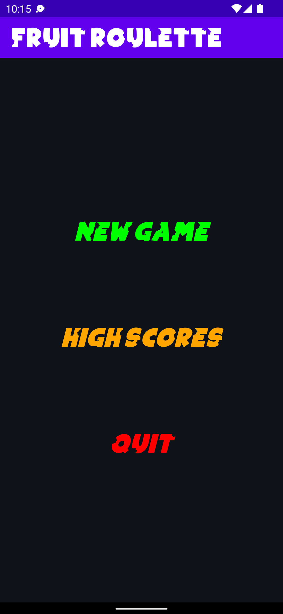
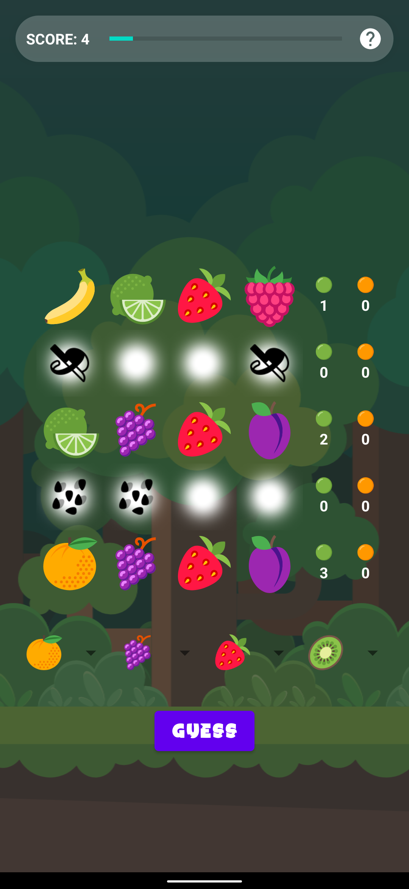
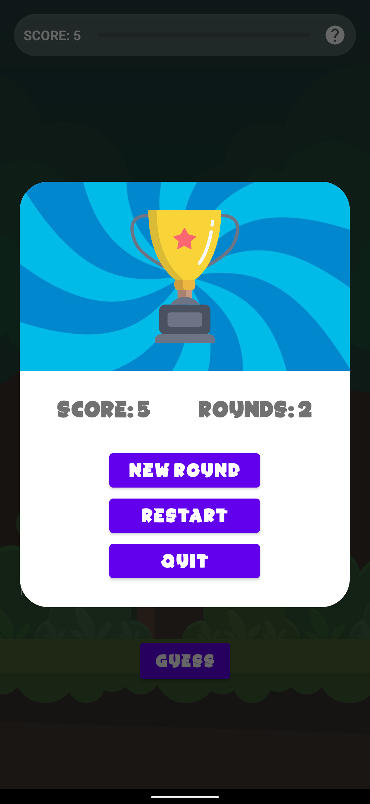
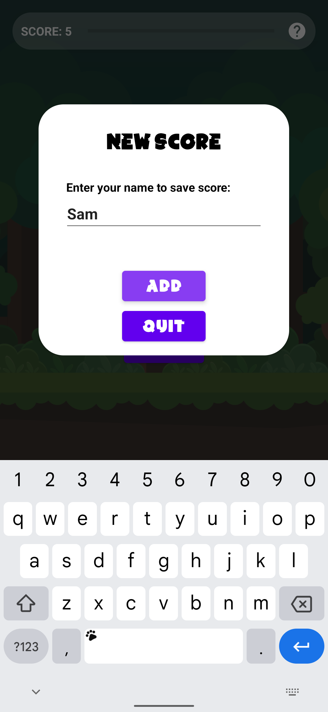
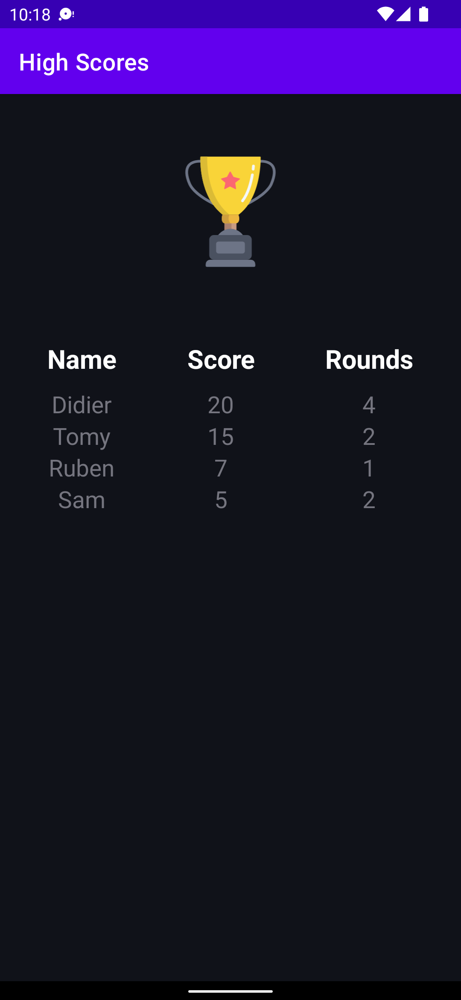

[![Contributors][contributors-shield]][contributors-url]

<!-- PROJECT LOGO -->
 

      
<h3 align="center">Fruit Roulette</h3>

  

    A Java-based Android game
  

<!-- TABLE OF CONTENTS -->

  
Table of Contents

  <ol>
    <li>
      <a href="#about-the-project">About the Project</a>
    </li>
    <li>
      <a href="#built-with">Built With</a>
    </li>
    <li>
        <a href="#installation">Installation</a>
    </li>
    <li>
      <a href="#contributors">Contributors</a>
  </li>
    <li>
      <a href="#license">License</a></li>
    <li><a href="#contact">Contact</a></li>
  </ol>

<!-- ABOUT THE PROJECT -->
## About The Project

Fruit Roulette is a Mastermind-like Android game where the player tries to find the correct combination of four different fruits. Coded in Java,
the app contains different activities,
a custom Recycler View and Adapter View and uses SQLite to store high scores. This is my first Android project,
done as a group work for a software developement course by the [@codingfactory](https://github.com/codingfactory-by-itescia). Original repository: https://github.com/arcreane/masterfruit-les-rois-du-frui

(<a href="#top">back to top</a>)

## Built With

* [Java](https://www.java.com)
* [Android Studio](https://developer.android.com/studio)
* [Icons8](https://icons8.com) (image assets)

(<a href="#top">back to top</a>)

## Installation

Run project using Android Studio.

<!-- USAGE EXAMPLES -->
## Usage

<!-- CONTRIBUTING -->
## Contributors

* [@rubenvieira](https://github.com/vieiraruben)
* [@JulienRibecco](https://github.com/JulienRibecco)
* [@tibz](https://github.com/tibz7884)

(<a href="#top">back to top</a>)

<!-- LICENSE -->
## License

Free for personal use. Graphics and font subject to their own licenses.

(<a href="#top">back to top</a>)

<!-- CONTACT -->
## Contact

LinkedIn Profile - [https://www.linkedin.com/in/vieiraruben](https://www.linkedin.com/in/vieiraruben/)

(<a href="#top">back to top</a>)

<!-- MARKDOWN LINKS & IMAGES -->
<!-- https://www.markdownguide.org/basic-syntax/#reference-style-links -->
[contributors-shield]: https://img.shields.io/github/contributors/arcreane/masterfruit-les-rois-du-frui.svg?style=for-the-badge  
[contributors-url]: https://github.com/arcreane/masterfruit-les-rois-du-frui/graphs/contributors
[forks-shield]: https://img.shields.io/github/forks/vieiraruben/Fruit-Roulette.svg?style=for-the-badge
[forks-url]: https://github.com/vieiraruben/Fruit-Roulette/network/members
[stars-shield]: https://img.shields.io/github/stars/vieiraruben/Fruit-Roulette.svg?style=for-the-badge
[stars-url]: https://github.com/vieiraruben/Fruit-Roulette/stargazers
[issues-shield]: https://img.shields.io/github/issues/vieiraruben/Fruit-Roulette.svg?style=for-the-badge
[issues-url]: https://github.com/vieiraruben/Fruit-Roulette/issues
[linkedin-shield]: https://img.shields.io/badge/-LinkedIn-black.svg?style=for-the-badge&logo=linkedin&colorB=555
[linkedin-url]: https://linkedin.com/in/vieiraruben
